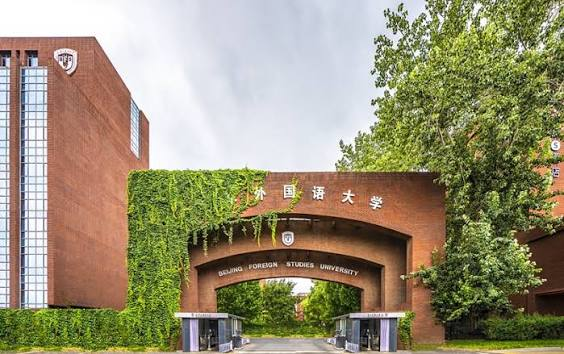
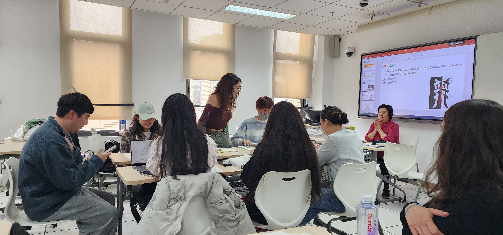

# Ma vie à l'université 

 J'ai eu la chance d'étudier à l'Université des Langues Étrangères de Pékin, très réputée pour ses cours de langues. Ma fac ayant un partenariat d'échange avec cette université, j'ai eu un peu moins de mal à me renseigner sur les modalités de cours qui m'attendaient.Les cours étaient tous dispensés en chinois, ce qui m'a forcé à m'immerger dans l'environnement chinois. Le semestre que j'ai passé dans cette université a été ponctuée de nombreux événements en tout genre : musique, sport, culture, comme par exemple la journée du sport, ou différents événements célébrant différents artistes.
 

</a>
  [</a>](https://en.bfsu.edu.cn/)
  
# Le campus

C'était la première fois que j'étudiais dans une université chinoise et donc je ne m'attendais pas à ce que le campus soit aussi grand. L'université se repartit en deux parties : le campus est et le campus ouest. Il y avait des cantines et des dortoirs des deux côtés, mais ayant cours dans le campus ouest, j'y passais bien plus de temps. Problème : j'habitais sur le campus est. Je devais donc traverser tout le campus est et le campus ouest, car le département d'études chinoises se situait au bout du campus ouest. Bonjour le(s) retard(s)...

Le campus ouest comportait un grand terrain de football avec deux terrains de baskets et une piste d'athlétisme, et j'y ai passé beaucoup de temps à regarder les autres faire du sport. C'était souvent là que s'organisaient les évènements qui rythmaient la vie étudiante.

  
 </a> 
  
# Mes rencontres 

J'ai eu la chance de tomber sur une colocataire francophone. Elle venait de Belgique et je n'ai jamais été aussi heureuse d'entendre un "bonjour" de tout ma vie. J'habitais donc en colocation dans un tout petit dortoir avec trois lits. On avait aussi un 3ème colocataire, mais elle a du partir en cours de semestre pour une urgence personnelle. J'ai dû donc apprendre à cohabiter avec une inconnue. J'ai aussi eu la chance de rencontrer un groupe de Français sur le campus et d'avoir sympathisé avec mes camarades de classe. Sans oublier mes amies que je connaissais de ma licence et sans qui ce voyage aurait été nettement plus difficile à gérer. Grâce à toutes ces personnes, j'ai passé un semestre remplis de souvenirs inoubliables et j'ai très hâte de pouvoir retourner en Chine un jour.

</a>
 </a>
  </a>

[Home](https://emmanuellaalley-arch.github.io/partie-en-chine/)
