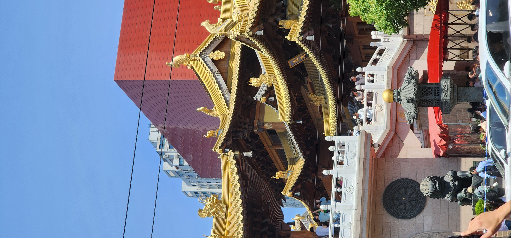
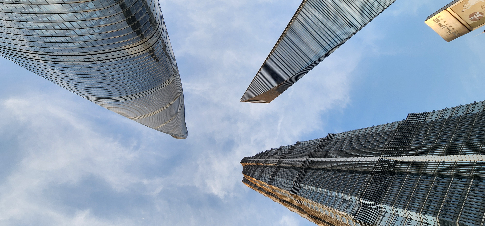
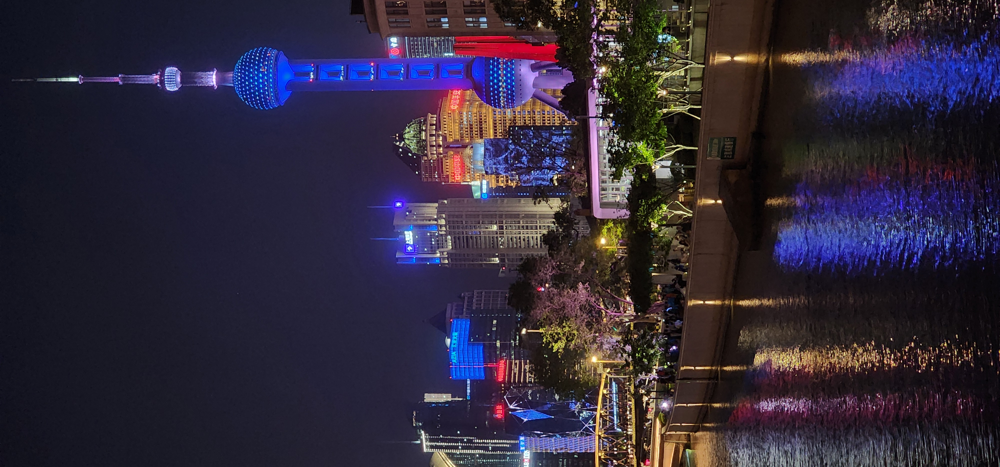
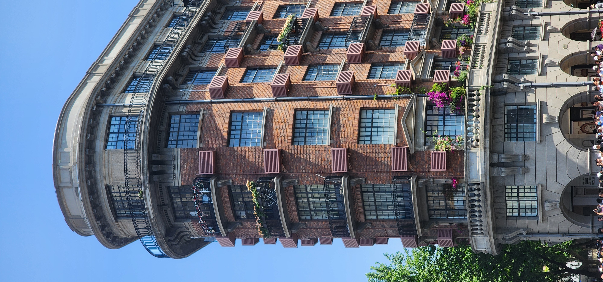
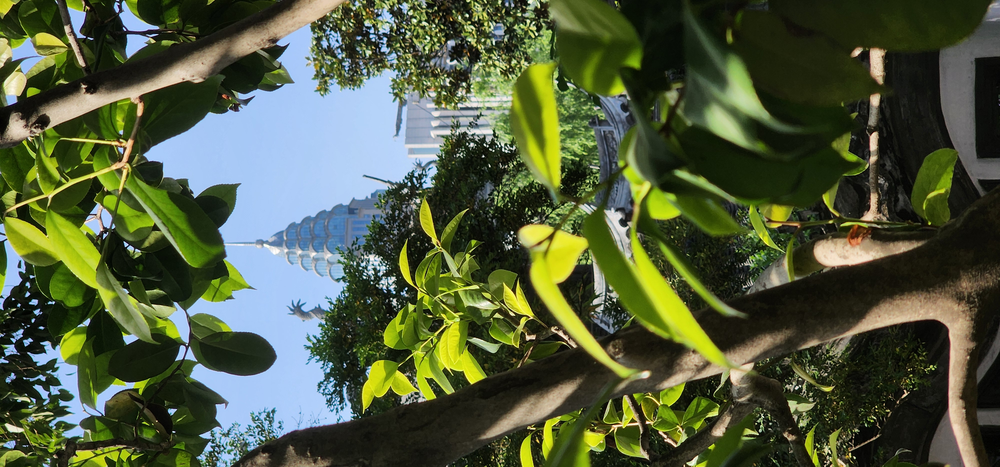
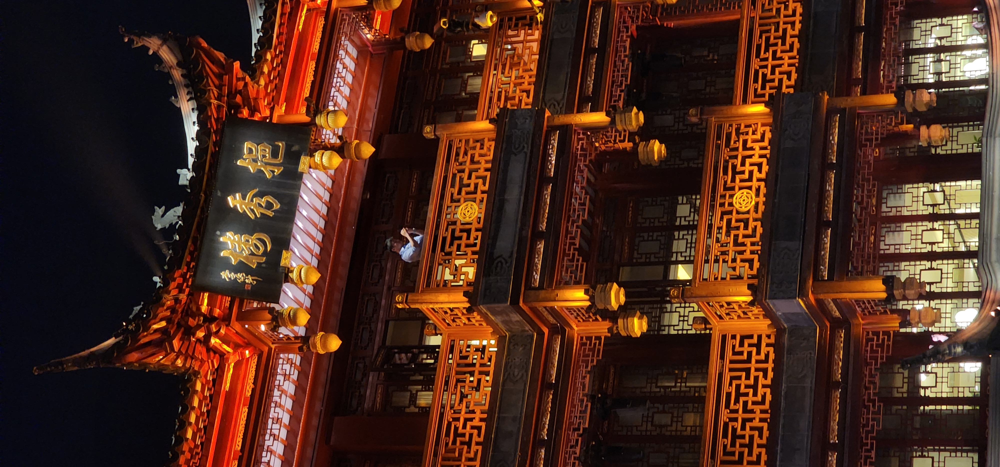

# Mes voyages 

Pour conclure, voici un petit florilège de photos que j'ai prises au cours de mes voyages dans différentes villes en Chine.

  
好不好看?
 
  
 ## Shanghai
 

  

 ## Suzhou
 
 

   
 
 
 
 
 
 ## Hangzhou
 
 
  
   
  
 ## Chengdu

 
  
   
 
 ## Tianjin

 
  
   

 ## Chongqing
 
   
  
   
    
     
      
 
 ## Taiyuan
 
 
 
 

[Home](https://emmanuellaalley-arch.github.io/partie-en-chine/)
