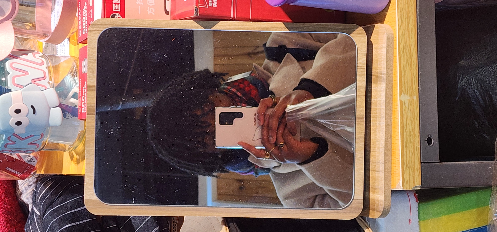

# Mes voyages 

Pour conclure, voici un petit florilège de photos que j'ai prises au cours de mes voyages dans différentes villes en Chine.

  
好不好看?
 
  
## Shanghai

## Suzhou

## Hangzhou

## Chengdu

## Tianjin

## Chongqing

## Taiyuan

[Home](https://emmanuellaalley-arch.github.io/partie-en-chine/)
